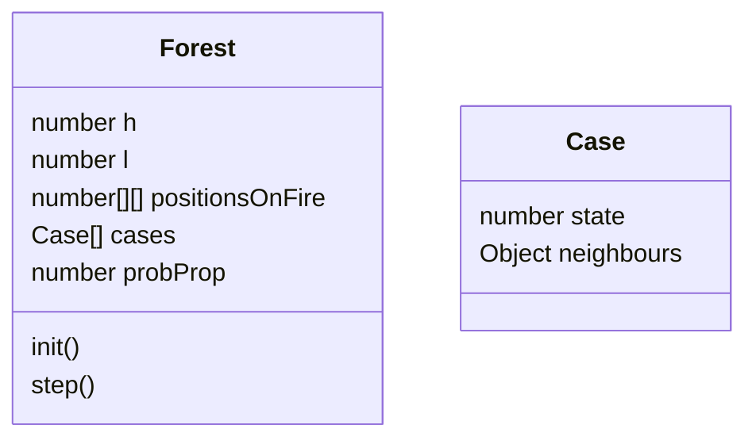

# Test Technique Ciril Group

## Énoncé :

L'objectif est d'implémenter une simulation de la propagation d’un feu de forêt.

Durée indicative de l’exercice : environ 2h/3h

La forêt est représentée par une grille de dimension h x l.

La dimension temporelle est discrétisée. Le déroulement de la simulation se fait donc étape par étape.

Dans l’état initial, une ou plusieurs cases sont en feu.

Si une case est en feu à l’étape t, alors à l’étape t+1 :

· Le feu s'éteint dans cette case (la case est remplie de cendre et ne peut ensuite plus brûler)

· et il y a une probabilité p que le feu se propage à chacune des 4 cases adjacentes

La simulation s’arrête lorsqu’il n’y a plus aucune case en feu

Les dimensions de la grille, la position des cases initialement en feu, ainsi que la probabilité de propagation, sont des paramètres du programme stockés dans un fichier de configuration (format libre).

## Questions ?

- Apréhension du problème ?
- Comment le code est produit ?
- Choix architecturaux
- Présentation d'un travail réalisé ?

## Actions Tracking

- **Choix du langage**:

  - Javascript avec un build des scripts avec webpack

- **Environnement de travail**:

  - Create file / folder : index.html, package.json(npm init), webpack.config.js, src/, assets/config.json
  - Install package : webpack webpack-cli
  - Fill files : index.hmtl, webpack.config.json, package.json (script build)

- **Conception du code**

  - Décortiquer l'ennoncer pour ressortir les classes pertinentes

- **Code**
